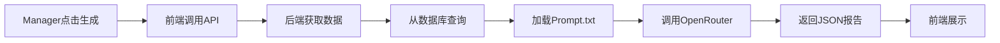
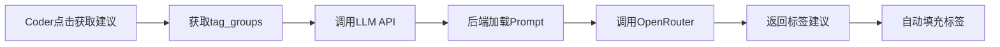

# 🎨 LLM 前端集成说明

## 📌 集成完成

已在以下页面集成LLM功能：

1. ✅ **Manager Dashboard** - 周报和月报生成
2. ✅ **Coder页面** - AI标注建议

---

## 🏗️ 新增的文件

```
OpenCoderFrontend/
├── src/
│   ├── services/
│   │   └── llm.ts                            ✨ LLM API调用服务
│   │
│   └── components/
│       └── reports/
│           ├── ReportsTab.tsx                ✨ Dashboard Reports标签内容
│           └── ReportDisplay.tsx             ✨ 报告展示组件
│
└── 修改的文件：
    ├── pages/manager/Dashboard.tsx           ✅ 集成ReportsTab
    └── pages/Coder.tsx                       ✅ 添加AI建议按钮
```

---

## 🎯 功能 1：Manager Dashboard - 报告生成

### **位置：** `Project Manager Dashboard → Reports标签`

### **功能：**

#### **1. 周报生成**
- 📅 自动分析最近7天数据
- 🤖 AI生成专业周报
- 📊 包含进度、团队表现、亮点、问题、建议
- 💾 可导出JSON格式

#### **2. 月报生成**
- 📅 分析上个月数据
- 🤖 AI生成全面月报
- 📊 包含月度进度、每周分解、质量指标、成就、计划
- 💾 可导出JSON格式

### **UI界面：**

```
┌─────────────────────────────────────────────┐
│  Dashboard                                  │
│  ┌────────────────────────────────────┐    │
│  │ [Overview] [Analytics] [Reports] ← │    │
│  └────────────────────────────────────┘    │
│                                             │
│  ┌─────────────┐  ┌──────────────┐        │
│  │  周报生成   │  │  月报生成    │        │
│  │  📅 最近7天  │  │  📅 上个月   │        │
│  │  [生成周报]  │  │  [生成月报]  │        │
│  │  [导出周报]  │  │  [导出月报]  │        │
│  └─────────────┘  └──────────────┘        │
│                                             │
│  ┌──────────────────────────────────────┐  │
│  │ 📊 周报                             │  │
│  │ 2024-01-15 至 2024-01-21           │  │
│  │ ▼ 点击展开查看详细内容              │  │
│  └──────────────────────────────────────┘  │
└─────────────────────────────────────────────┘
```

### **使用步骤：**

1. **进入Reports标签**
   - 登录Manager账号
   - 进入Dashboard
   - 点击 "Reports" 标签

2. **生成周报**
   - 点击 "生成周报" 按钮
   - 等待3-5秒（AI生成中）
   - 自动展开显示报告
   - 可点击 "导出周报" 保存JSON

3. **生成月报**
   - 点击 "生成月报" 按钮
   - 等待5-8秒（AI生成中）
   - 自动展开显示报告
   - 可点击 "导出月报" 保存JSON

---

## 🎯 功能 2：Coder页面 - AI标注建议

### **位置：** `Coder页面 → Annotation Tags卡片`

### **功能：**

- 🤖 一键获取AI标注建议
- 🎯 自动填充所有标签组
- 📊 显示置信度和理由
- ✅ 支持单选和多选标签组

### **UI界面：**

```
┌─────────────────────────────────────────────┐
│  Current Task                               │
│  ┌─────────────────────────────────────┐   │
│  │ 这部电影非常精彩，值得一看！        │   │
│  └─────────────────────────────────────┘   │
└─────────────────────────────────────────────┘

┌─────────────────────────────────────────────┐
│  Annotation Tags            [✨ 获取AI建议] │
│                                             │
│  ┌─────────────────────────────────────┐   │
│  │ ✨ AI建议   置信度: 92%            │   │
│  │ 文本明确表达了对电影的正面评价...  │   │
│  └─────────────────────────────────────┘   │
│                                             │
│  情感倾向 *                                 │
│  ● 正面  ○ 负面  ○ 中立   ← AI已选择     │
│                                             │
│  话题分类 *                                 │
│  ☑ 娱乐  ☑ 电影  ☐ 科技   ← AI已选择     │
│                                             │
│  [保存标注]                                 │
└─────────────────────────────────────────────┘
```

### **使用步骤：**

1. **查看当前任务**
   - 登录Coder账号
   - 任务自动加载

2. **获取AI建议**
   - 点击 "获取AI建议" 按钮（右上角）
   - 等待1-2秒
   - AI自动选择所有标签
   - 显示置信度和理由

3. **审核和修改**
   - 查看AI选择的标签
   - 如果需要，手动调整
   - 点击 "保存标注"

---

## 🔄 数据流程

### **周报/月报流程：**



**数据来源：**
- ✅ MongoDB数据库（annotations, tasks, users collections）
- ✅ 自动聚合和统计

### **标注建议流程：**



**数据来源：**
- ✅ tag_groups从项目配置获取
- ✅ 任务文本从当前任务获取

---

## 📝 代码说明

### 1. LLM Service (`services/llm.ts`)

**作用：** 封装所有LLM API调用

**主要函数：**

```typescript
// 生成周报
generateWeeklyReport(projectId, startDate, endDate, token)

// 生成月报  
generateMonthlyReport(projectId, year, month, token)

// AI标注建议
getAnnotationSuggestion(sentence, tagGroups, token)

// 工具函数
getLast7Days()    // 获取最近7天日期
getLastMonth()    // 获取上个月年月
```

### 2. ReportsTab Component

**作用：** Dashboard的Reports标签内容

**功能：**
- 显示周报和月报生成按钮
- 处理报告生成逻辑
- 展示生成的报告
- 支持导出功能

### 3. ReportDisplay Component

**作用：** 渲染报告内容

**支持：**
- 周报展示（进度、团队、亮点、问题、建议）
- 月报展示（月度进度、每周分解、质量指标、成就等）
- 美观的UI设计

### 4. Coder页面集成

**新增：**
- AI建议按钮（右上角）
- AI建议结果显示（蓝色渐变卡片）
- 自动填充标签逻辑

---

## 🎨 UI特性

### **Dashboard Reports标签：**

1. **生成按钮**
   - 🎨 紫色主题按钮
   - ⏳ 生成中显示Loading动画
   - ✅ 生成后显示导出按钮

2. **报告展示**
   - 📊 卡片式布局
   - 🎯 可折叠/展开
   - 🎨 图标和颜色区分不同部分
   - 📈 数据可视化（进度、成员表现）

### **Coder页面AI建议：**

1. **建议按钮**
   - 🎨 Outline风格（不抢眼）
   - ✨ Sparkles图标
   - ⏳ 加载状态

2. **建议显示**
   - 🎨 蓝紫渐变背景
   - 📊 置信度Badge
   - 💬 理由说明
   - ✅ 自动填充标签

---

## 💡 用户体验优化

### **Manager使用场景：**

**每周例会前：**
```
1. 打开Dashboard → Reports
2. 点击"生成周报"
3. 等待3秒
4. 查看报告内容
5. 截图分享或导出JSON
```

**月度总结：**
```
1. 月初打开Dashboard → Reports
2. 点击"生成月报"
3. 等待5秒
4. 查看月度数据和趋势
5. 根据建议规划下月工作
```

### **Coder使用场景：**

**标注不确定时：**
```
1. 看到任务文本
2. 不确定如何标注
3. 点击"获取AI建议"
4. 查看AI的选择和理由
5. 决定是否接受或修改
6. 保存标注
```

**快速标注：**
```
1. 任务简单明确
2. 点击"获取AI建议"
3. 快速验证AI选择正确
4. 直接保存（提升效率）
```

---

## 🔧 配置要求

### **后端：**

```env
# .env
OPENROUTER_API_KEY=sk-or-v1-xxxxxxxxxxxxx
LLM_MODEL=anthropic/claude-3.5-haiku
APP_URL=http://localhost:8000
```

### **前端：**

```env
# .env
VITE_API_BASE_URL=http://localhost:8000
```

---

## 🚀 测试步骤

### **1. 测试周报生成**

```bash
# 1. 启动后端
cd OpenCoderBackend
python main.py

# 2. 启动前端
cd OpenCoderFrontend
npm run dev

# 3. 测试
# - 登录Manager账号
# - 进入Dashboard → Reports标签
# - 点击"生成周报"
# - 查看报告
```

### **2. 测试月报生成**

```bash
# 在Dashboard → Reports标签
# - 点击"生成月报"
# - 查看月度报告
```

### **3. 测试AI标注**

```bash
# 1. 登录Coder账号（或Manager切换到Coder Mode）
# 2. 查看当前任务
# 3. 点击"获取AI建议"
# 4. 查看自动填充的标签
# 5. 验证标签是否合理
```

---

## 💰 成本显示

每次生成报告后，UI会显示：

```
模型: anthropic/claude-3.5-haiku
成本: $0.0020
```

这样Manager可以追踪LLM使用成本。

---

## 🎯 关键代码片段

### Manager Dashboard - 调用周报

```typescript
// 来自 services/llm.ts
import { generateWeeklyReport, getLast7Days } from '@/services/llm';

const handleGenerate = async () => {
  const { startDate, endDate } = getLast7Days();
  const result = await generateWeeklyReport(
    projectId,
    startDate,
    endDate,
    token
  );
  
  if (result.success) {
    setReport(result.report);  // 显示报告
  }
};
```

### Coder页面 - 调用AI建议

```typescript
// 来自 Coder.tsx
const handleGetAISuggestion = async () => {
  // 1. 准备tag_groups
  const tagGroupsForAI = tagGroups.map(group => ({
    group_id: group.group_id,
    group_name: group.name,
    type: group.type,
    options: group.options
  }));
  
  // 2. 调用API
  const response = await fetch(
    `${apiBaseUrl}/api/llm/annotate?token=${token}`,
    {
      method: 'POST',
      body: JSON.stringify({
        sentence: currentTask.payload.text,
        tag_groups: tagGroupsForAI
      })
    }
  );
  
  // 3. 自动填充标签
  const result = await response.json();
  if (result.success) {
    const suggestions = {};
    result.annotation.labels.forEach(label => {
      suggestions[label.group_id] = label.selected;
    });
    setSelectedTags(suggestions);  // 自动填充
  }
};
```

---

## 📊 响应格式示例

### **周报响应：**

```json
{
  "success": true,
  "report": {
    "title": "项目周报 (2024-01-15 至 2024-01-21)",
    "summary": "本周完成250个标注...",
    "sections": {
      "progress": {...},
      "team_performance": {...},
      "highlights": [...],
      "issues": [...],
      "recommendations": [...]
    }
  },
  "metadata": {
    "cost": 0.002
  }
}
```

### **标注建议响应：**

```json
{
  "success": true,
  "annotation": {
    "labels": [
      {
        "group_id": "sentiment",
        "selected": ["positive"],
        "confidence": 0.95
      }
    ],
    "overall_confidence": 0.92,
    "reasoning": "文本明确表达正面情感..."
  }
}
```

---

## 🔧 自定义和扩展

### **修改报告样式：**

编辑 `components/reports/ReportDisplay.tsx`

```tsx
// 修改颜色主题
className="bg-blue-50"  // 改为其他颜色

// 添加新的展示section
{report.sections.custom_section && (
  <Card>
    <CardHeader>
      <CardTitle>自定义部分</CardTitle>
    </CardHeader>
    <CardContent>
      {/* 自定义内容 */}
    </CardContent>
  </Card>
)}
```

### **修改AI建议样式：**

编辑 `pages/Coder.tsx` 中的AI建议显示部分

```tsx
<div className="p-4 bg-gradient-to-r from-blue-50 to-purple-50">
  {/* 自定义AI建议显示 */}
</div>
```

---

## 🐛 故障排查

### **报告生成失败：**

**检查：**
1. ✅ 后端是否配置了 `OPENROUTER_API_KEY`
2. ✅ prompts目录下是否有对应的txt文件
3. ✅ 项目是否有数据（annotations, tasks）
4. ✅ 浏览器Console是否有错误信息

**常见错误：**

```
❌ "Prompt template not found"
→ 检查 prompts/weekly_report.txt 是否存在

❌ "Failed to fetch project data"
→ 检查项目是否有标注数据

❌ "OPENROUTER_API_KEY not configured"
→ 检查后端.env配置
```

### **AI建议不准确：**

**解决方法：**
1. 编辑 `prompts/annotation.txt` 优化Prompt
2. 尝试不同的LLM模型
3. 调整temperature参数（降低使输出更稳定）

---

## 📈 性能优化建议

### **1. 添加Loading状态**

已实现：
- ✅ 周报生成中显示Loading
- ✅ 月报生成中显示Loading
- ✅ AI建议生成中显示Loading

### **2. 缓存报告**

可以添加本地缓存：

```typescript
// 检查是否已有今天的周报
const cachedReport = localStorage.getItem(`weekly_report_${date}`);
if (cachedReport) {
  setWeeklyReport(JSON.parse(cachedReport));
  return;
}
```

### **3. 防抖AI建议**

避免频繁点击：

```typescript
import { debounce } from 'lodash';

const handleGetAISuggestionDebounced = debounce(
  handleGetAISuggestion,
  500
);
```

---

## 🎉 完成的集成

### ✅ **Manager Dashboard:**
- 周报生成按钮和展示
- 月报生成按钮和展示
- 报告导出功能
- 错误处理

### ✅ **Coder页面:**
- AI建议按钮
- AI建议结果显示
- 自动填充标签
- 置信度和理由展示

### ✅ **服务层：**
- API调用封装
- 类型定义
- 错误处理
- 工具函数

### ✅ **UI组件：**
- 报告展示组件
- Reports标签组件
- 响应式设计
- 美观的UI

---

## 📚 相关文档

- [后端API文档](../OpenCoderBackend/LLM_USAGE_GUIDE.md)
- [Prompt模板](../OpenCoderBackend/prompts/)
- [快速开始](../OpenCoderBackend/LLM_QUICK_START.md)

---

## 🎯 下一步

1. **测试功能** - 在本地环境测试所有功能
2. **优化Prompt** - 根据实际效果调整Prompt模板
3. **UI优化** - 根据使用体验优化界面
4. **添加更多功能** - 如报告对比、历史记录等

---

**集成完成！现在可以开始使用AI辅助功能了！** 🎊
